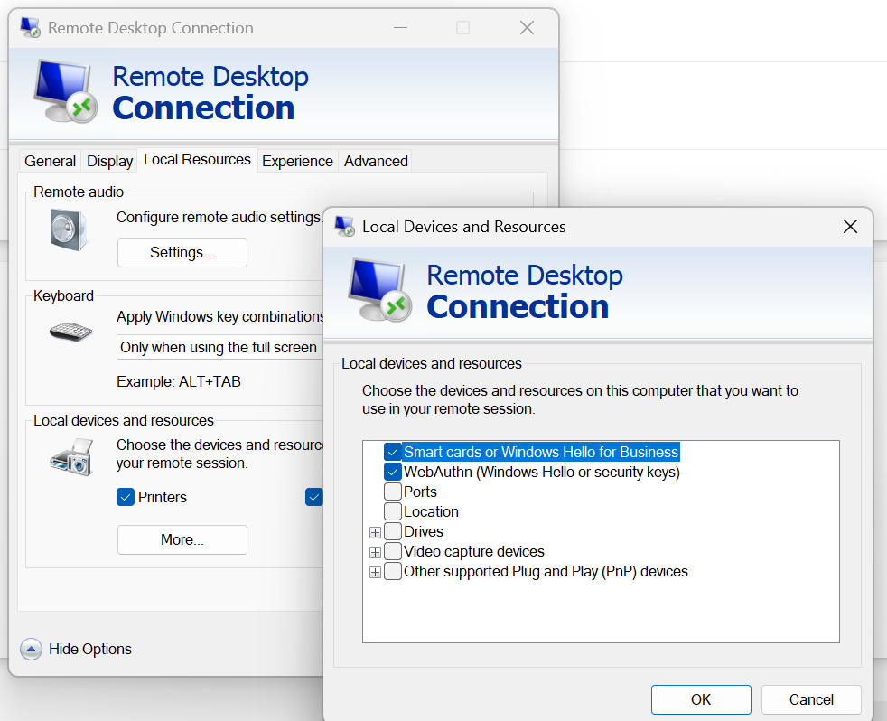

**⚠️ Troubleshooting Certificate Generation in ALDO Build 2605**

**The Issue**

When generating certificates using the updated PowerShell module **New-ApplianceExternalCertificatesFromCA**, the process can take **5+ hours** to complete. By contrast, the legacy build 2603 module (**New-AldoManagementCertificatesFromCA**) typically completes in about **20 minutes**.

**Root Cause**

This massive performance drop is caused by active Remote Desktop (RDP) session redirection settings. The new certificate module queries local cryptographic providers; if RDP smart card redirection is active, the system continuously attempts to poll the client machine for a smart card reader, triggering consecutive, heavy network timeout delays.

**The Fix**

Before launching your RDP session to the deployment host, ensure local resource redirection is disabled:

- Open your **Remote Desktop Connection (mstsc)** client.
- Click **Show Options** and navigate to the **Local Resources** tab.
- Under _Local devices and resources_, click **More...**.
- 🚫 Uncheck **Smart cards or Windows Hello for Business**.
- Click **OK** and connect.

**Note:** If you are running this automated pipeline via a jump box or administrative host, applying this RDP configuration change will instantly drop the execution time back down to its expected baseline.
